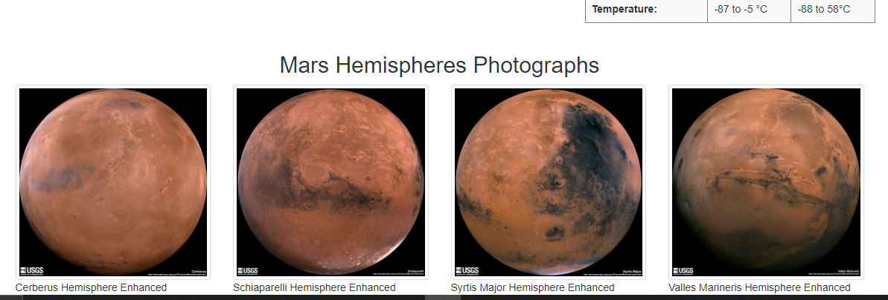

# Mission to Mars

### image courtesy of: https://mars.nasa.gov/resources/26101/perseverances-office-on-mars/

  

## ***Overview of Analysis:***
The purpose of this analysis was to utilize web-scraping techniques to create a website with information on Mars collected from NASA and other various space exploration websites. 

## ***Results:***

Our code was able to produce the above website. The website is designed to be interactive and changeable according to updates to connected websites. The "Scrape New Data" button will run the code through MongoDB and store the most recent news, fact, and images in a clean and concise format. The website is also functional across mobile platforms. 
